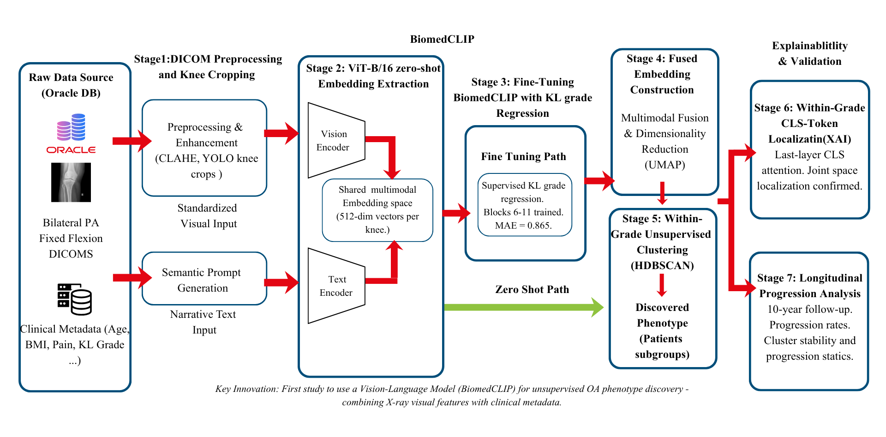
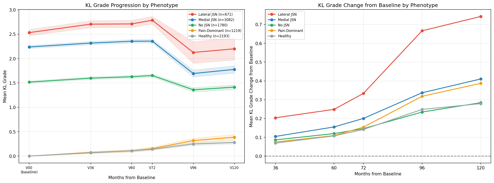
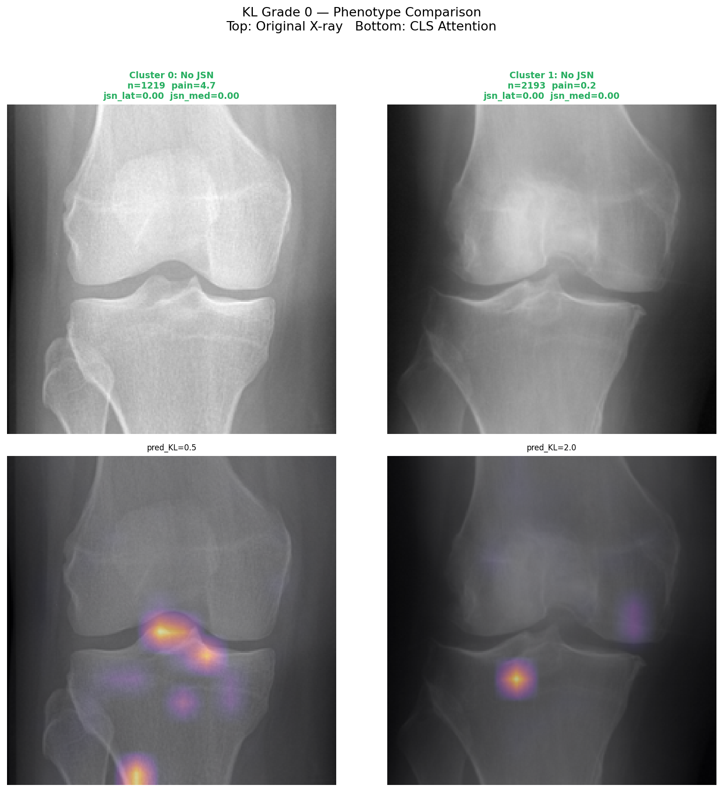

# KneeOA-VLM: Multimodal Phenotyping of Knee Osteoarthritis

> **Discovering hidden subtypes of Knee Osteoarthritis using AI-driven Vision-Language Models.**

Standard radiographic grading (Kellgren-Lawrence) often fails to capture the biological diversity of Knee Osteoarthritis (KOA). Two patients with the same "Grade 2" diagnosis can experience vastly different pain levels and progression rates. 

**KneeOA-VLM** addresses this "Discordance Paradox" by fine-tuning a Vision-Language Model (BiomedCLIP) on 8,945 knee X-rays to discover clinically meaningful phenotypes that traditional grading misses.

---

## 🔬 Key Clinical Findings

* **Faster Progression:** Lateral Joint Space Narrowing (JSN) phenotypes progress **2× faster** than Medial JSN over 10 years ($p < 0.0001$).
* **Pain-Susceptibility:** Discovered a "Pain-Dominant" cluster in KL Grade 0 (1,219 patients) with high pain (WOMAC = 4.7) despite zero structural damage.
* **High Stability:** Phenotype clusters showed **95.0% – 97.2% stability** over an 8-year longitudinal period.
* **Stratification:** 50% of Lateral JSN patients progressed $\ge 1$ KL grade by year 8, compared to only 16.7% in the healthy group.

---

##  The 7-Stage AI Pipeline

Our framework transitions from raw hospital DICOM files to validated clinical subtypes.

*Fig 1. Full seven-stage architecture involving BiomedCLIP fine-tuning and HDBSCAN clustering.*

1.  **DICOM Preprocessing:** YOLO-based cropping of 4,502 bilateral X-rays.
2.  **Zero-Shot Embedding:** Initial feature extraction using BiomedCLIP.
3.  **Fine-Tuning:** KL-grade regression (training the upper 6 transformer blocks).
4.  **Multimodal Fusion:** Combining visual embeddings with pain scores, BMI, and age.
5.  **HDBSCAN Clustering:** Within-grade clustering to find severity-independent phenotypes.
6.  **XAI Validation:** Attention map verification (CLS-token).
7.  **Longitudinal Check:** 10-year follow-up validation using OAI V00–V10 data.

---

##  Discovered Phenotypes

| Phenotype | Key Characteristics | Clinical Implication |
| :--- | :--- | :--- |
| **Lateral JSN** | Dominant lateral narrowing; fastest progression. | Targeted lateral unloading bracing. |
| **Medial JSN** | Most common; moderate progression rate. | Standard medial compartment management. |
| **No JSN** | Osteophyte-dominant; minimal narrowing. | Focus on structural stability. |
| **Pain-Dominant** | High pain (WOMAC 4.7) / KL 0 structural. | Neurobiological pain management. |
| **Healthy** | Low pain / zero structural damage. | Baseline comparator. |

---

## 📊 Results & Validation

### Longitudinal Progression
The Lateral JSN phenotype accumulates a mean $\Delta KL$ of 0.75 by the 10-year mark, nearly triple that of the healthy group.

### Explainable AI (XAI)
Fine-tuning shifted the model's focus from image borders to the joint space line and femoral condyles, aligning with radiologist priorities.

---

##  Technical Details

### Model Configuration
| Parameter | Value |
| :--- | :--- |
| **Base Model** | BiomedCLIP ViT-B/16 |
| **Trainable Params** | 42.9M (21.9%) |
| **Within-1 Accuracy** | 86.4% |
| **Val MAE** | 0.865 KL units |
| **Clustering** | HDBSCAN (Independent per grade) |

### Selective Layer Freezing
To prevent catastrophic forgetting, Transformer blocks 0–5 and positional embeddings were frozen. Only blocks 6–11 and the regression head were trained using MSE loss with a sigmoid activation scaled to $[0,4]$.

---

##  Research Team

* **I.A.U. Siriwardane** (E/20/378) - [GitHub](https://github.com/amandasiriwardane)
* **K.G.H. Nirmani** (E/20/271) - [GitHub](https://github.com/rash0621)
* **N.R.P. Gunathilake** (E/20/122) - [GitHub](https://github.com/hasini416)

### Supervisors
* **Ms. Yasodha Vimukthi** (Dept. of Computer Engineering),  [email](mailto:yashodhav@eng.pdn.ac.lk)
* **Dr. Damayanthi Herath** (Dept. of Computer Engineering), [email](mailto:damayanthiherath@eng.pdn.ac.lk)
* **Mr. A.M. Mohamed Rikas** (Dept. of Physiotherapy)

---

## 🏛️ Acknowledgments
This work was conducted at the **Department of Computer Engineering, University of Peradeniya**, Sri Lanka, utilizing data from the **Osteoarthritis Initiative (OAI)**.
